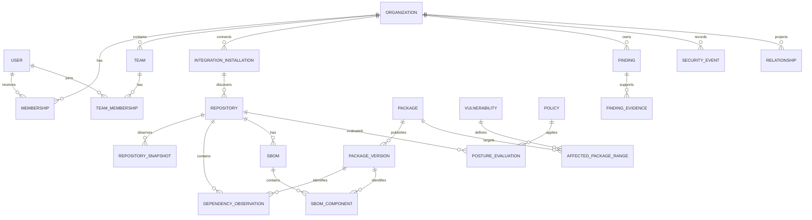

# Initial Data Model

**Status:** Conceptual Phase 0 draft  
**Database:** PostgreSQL  
**Date:** 2026-09-21

## Modeling Principles

- Use UUID primary keys generated by the platform; external IDs are data, not primary keys.
- Put `organization_id` on every organization-owned aggregate and include it in uniqueness constraints and indexes.
- Preserve observations and source provenance instead of overwriting historical evidence.
- Store queryable, security-relevant fields relationally; reserve `jsonb` for bounded source metadata and evidence that varies by provider.
- Use UTC timestamps and retain provider occurrence time separately from ingestion time.
- Use database constraints for invariants and application authorization for permissions; neither substitutes for the other.
- Keep provider-specific identifiers in integration-owned tables or clearly named external-reference fields.

## Relationship Overview

## Identity and Organization

| Entity | Required fields and constraints |
| --- | --- |
| `organization` | `id`, unique `slug`, `display_name`, `status`, `created_at`, `updated_at` |
| `user_account` | `id`, unique normalized `email`, `display_name`, `status`, timestamps |
| `membership` | `id`, `organization_id`, `user_id`, `role`, timestamps; unique `(organization_id, user_id)` |
| `team` | `id`, `organization_id`, `name`, `external_ref`, timestamps; unique `(organization_id, name)` |
| `team_membership` | `organization_id`, `team_id`, `user_id`, timestamps; unique `(team_id, user_id)` and organization-consistency constraint |

Initial roles are `OWNER`, `ADMIN`, `SECURITY_ANALYST`, `DEVELOPER`, and `VIEWER`. Permissions will be mapped separately so role names do not become scattered authorization logic.

## Integrations and Ingestion

| Entity | Required fields and constraints |
| --- | --- |
| `integration_installation` | `id`, `organization_id`, `provider`, provider installation/account IDs, `status`, encrypted credential reference, permission snapshot, timestamps; unique provider installation ID |
| `webhook_delivery` | `id`, `organization_id`, installation ID, provider delivery ID, event type, signature status, payload digest, received/processed times, processing status, sanitized error; unique `(provider, provider_delivery_id)` |
| `sync_cursor` | `id`, `organization_id`, installation ID, resource type, opaque cursor, last success time; unique per installation/resource |
| `job` | `id`, `organization_id`, `type`, idempotency key, status, attempt count, schedule/start/finish times, sanitized error; unique `(organization_id, type, idempotency_key)` |

Raw webhook bodies are not retained by default. If later required for evidence or replay, retention, encryption, access, and deletion rules must be approved first.

## Repository and Posture

| Entity | Required fields and constraints |
| --- | --- |
| `repository` | `id`, `organization_id`, installation ID, provider repository ID, owner/name, visibility, default branch, archived flag, timestamps; unique `(installation_id, provider_repository_id)` |
| `repository_snapshot` | `id`, `organization_id`, repository ID, observed time, source revision/ETag, bounded settings metadata |
| `policy` | `id`, `organization_id`, name, version, status, deterministic definition, created_by, timestamps; unique `(organization_id, name, version)` |
| `posture_evaluation` | `id`, `organization_id`, repository ID, policy ID/version, control key/version, result, evaluated time, evidence digest, evidence reference |

Posture results are immutable observations. A current-state view selects the latest valid evaluation per repository, policy, and control.

## Packages, Dependencies, and SBOMs

| Entity | Required fields and constraints |
| --- | --- |
| `package` | `id`, normalized ecosystem, normalized name, package URL where available; unique normalized coordinates |
| `package_version` | `id`, package ID, normalized version, published time, metadata; unique `(package_id, normalized_version)` |
| `dependency_observation` | `id`, `organization_id`, repository ID, package-version ID or unresolved coordinate, scope, direct flag, manifest path, source revision, observed time |
| `dependency_edge` | `id`, `organization_id`, observation/root ID, parent package-version ID, child package-version ID, depth; unique edge within an observation |
| `sbom` | `id`, `organization_id`, repository ID, format, specification version, serial/document namespace, source revision, digest, created/ingested times; digest unique within organization |
| `sbom_component` | `id`, `organization_id`, SBOM ID, package-version ID or unresolved coordinate, component reference, scope, hashes, licenses; unique `(sbom_id, component_reference)` |

Unknown or invalid package coordinates remain explicit and must not be coerced into a false match.

## Vulnerabilities and Findings

| Entity | Required fields and constraints |
| --- | --- |
| `vulnerability` | `id`, canonical identifier, summary, published/modified times, withdrawal status; unique canonical identifier |
| `vulnerability_alias` | vulnerability ID, alias; unique alias |
| `affected_package_range` | `id`, vulnerability ID, package ID, range type, introduced/fixed/last-affected events, source and source revision |
| `finding` | `id`, `organization_id`, stable fingerprint, type, severity, status, title, affected entity type/ID, source, first/last detected times, resolved time; unique `(organization_id, fingerprint)` |
| `finding_evidence` | `id`, `organization_id`, finding ID, evidence type, source, source revision, observed time, bounded structured evidence, digest |
| `finding_status_history` | `id`, `organization_id`, finding ID, previous/new status, actor ID, reason, changed time |

Severity is one of `INFO`, `LOW`, `MEDIUM`, `HIGH`, or `CRITICAL`. Finding status uses the values defined in the requirements. Source severity and normalized severity are stored separately when both are needed.

## Events and Graph Projection

| Entity | Required fields and constraints |
| --- | --- |
| `security_event` | `id`, `organization_id`, source, source event/delivery ID, action, actor reference, resource type/ID, occurred/ingested times, previous/current state references, metadata digest; unique source identity where available |
| `relationship` | `id`, `organization_id`, source type/ID, relationship type, target type/ID, valid-from/to, provenance type/ID; unique active relationship tuple and provenance |

Security events are append-only facts. Corrections append a superseding event or metadata record rather than rewriting original evidence. Relationship rows are projections and can be rebuilt from owning domain records.

## Tenant Isolation and Integrity

- Foreign keys between organization-owned tables include or verify matching `organization_id`.
- Queries begin from an authorized organization scope; object IDs alone are insufficient.
- Unique constraints include organization scope unless an external identifier is globally unique by contract.
- Deletion policy distinguishes user-requested data deletion from security-event retention obligations.
- Sensitive JSON fields have schemas, size limits, and redaction rules.
- Optimistic locking protects mutable workflows such as finding status changes.

## Initial Index Strategy

- Organization plus common filters for repositories, findings, events, jobs, and evaluations.
- `(organization_id, occurred_at desc)` for timelines.
- `(organization_id, status, severity, last_detected_at desc)` for finding queues.
- Normalized package coordinates and vulnerability aliases for matching.
- Source/target typed identifiers for relationship traversal in both directions.
- Partial indexes for active/open records only after representative query analysis.

## Migration and Retention Rules

- Use versioned, immutable migrations; never edit a migration already applied outside a developer's local environment.
- Separate destructive data migrations from application releases when rollback is unsafe.
- Back up PostgreSQL and test restoration before releases.
- Define retention for webhook metadata, job details, snapshots, evidence, and events before production use.
- Do not use Redis expiry as a data-retention mechanism for authoritative records.

## Open Decisions

1. Exact SQL types, naming convention, and schema-per-module policy.
2. Row-level security as defense in depth versus application-enforced tenant filtering only.
3. JSON Schema strategy for policy definitions and variable evidence.
4. Package URL normalization library and unresolved-coordinate lifecycle.
5. Finding fingerprint algorithm and reconciliation rules.
6. Event correction, retention, and legal deletion policy.
7. Graph relationship vocabulary and traversal depth limits.
8. Scale assumptions used to validate indexes and partitioning needs.